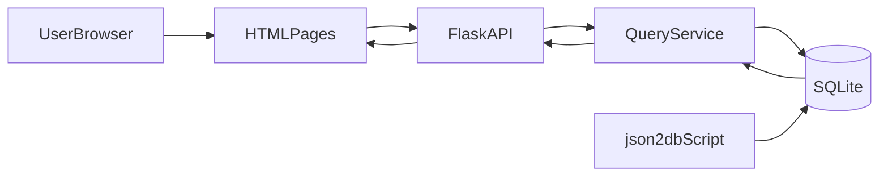

# ChatPD Architecture

## 1. Background

ChatPD is a dataset-usage discovery web application for academic papers. It provides:
- global search across paper and dataset metadata,
- dataset-centric browsing and detail pages,
- paper detail lookup by arXiv ID,
- a data refresh pipeline from JSON to SQLite.

The current architecture favors a lightweight stack:
- backend: Flask + SQLite
- frontend: server-rendered HTML pages with vanilla JavaScript
- data refresh: Python script importing normalized JSON into SQLite

## 2. Core Domain Model

- `Paper`: identified by `arxiv_id`, includes `title`, `task`, `data_type`, etc.
- `Dataset`: represented by `dataset_entity` (canonical), with optional `dataset_name`.
- `UsageRecord`: a row in `dataset_usage`, linking paper metadata and dataset metadata.

Primary storage table:
- `dataset_usage` (`arxiv_id`, `dataset_name`, ...), primary key: (`arxiv_id`, `dataset_name`).

## 3. System Components

### 3.1 Backend

- Flask app entry and routes: `src/web_app/search_engine.py`
- Query service and query builder: `src/web_app/query_service.py`
- Data import pipeline: `src/json2db.py`

Main backend responsibilities:
- parse/validate query params,
- construct safe SQL from whitelisted fields,
- pagination, sorting and lightweight aggregations,
- dataset/paper detail shaping,
- data status and metadata endpoints.

### 3.2 Frontend

- Home/search page: `index.html` + `static/js/script.js`
- Dataset list: `datasets.html`
- Dataset detail: `dataset.html`
- Shared visual styles: `static/css/styles.css`

Main frontend responsibilities:
- build query params from search controls,
- render result cards and state panels (loading/empty/error),
- manage pagination and filter interactions,
- display summary stats and detail metadata.

### 3.3 Data Layer

- SQLite file: `data/chatpd_data.db`
- Import source (default): `data/final_product/ChatPD_WebData_from_db.json`
- Refresh script: `python3 -m src.json2db`

Indexes are created during app startup for frequently queried fields
(`data_type`, `task`, `dataset_entity`, `arxiv_id`, `title`, `dataset_name`, and a composite index for `data_type + task`).

## 4. Runtime Flow

### 4.1 Search Flow
1. User sets keywords/filter/sort in home page.
2. Frontend calls `/api/query` as primary endpoint (advanced controls are optional and collapsed by default).
3. Legacy clients can still call `/api/search`, which is a compatibility wrapper over the same query service.
4. Backend validates fields/match modes/sort settings.
5. Query service returns paged rows and optional distribution stats.
6. Frontend renders cards, count summary and pagination.

### 4.2 Dataset Detail Flow
1. User opens `/dataset/<dataset_entity>`.
2. Frontend fetches `/api/dataset/<dataset_entity>`.
3. Backend returns canonical dataset info + usage records + aggregate summary.
4. Frontend renders metadata sections and linked papers.

### 4.3 Data Refresh Flow
1. Operator runs `python3 -m src.json2db`.
2. Script rebuilds `dataset_usage` and upserts rows.
3. Runtime endpoints (`/api/data-status`) expose DB/JSON update metadata.

## 5. API Contracts

### 5.1 Existing and Enhanced Query API

`GET /api/query`

Parameters:
- `q`: keyword fallback (optional)
- `field`: `all|arxiv_id|title|dataset_name|dataset_entity|task|data_type`
- `match_mode`: `contains|exact|prefix`
- `page`, `per_page`
- `sort_by`: allowed sortable field, default `latest`
- `sort_order`: `asc|desc`, default `desc` (`latest`/`earliest` auto-normalized)
- `logic`: `and|or` for multi-condition search, default `and`
- `conditions`: JSON array of `{ field, value, match_mode }`
- `include_stats`: `true|false` whether to include task/data_type distribution (default `true`)

Response (shape):
- `results`, `results_count`, `total_pages`, `current_page`, `per_page`, `returned_count`
- `query_meta`: resolved query options
- `stats` (optional): `task_distribution`, `data_type_distribution`

### 5.2 Search API for Home Filters

`GET /api/search`

Parameters:
- `keywords`, `data_type`, `task`, `page`, `per_page`
- `sort_by`, `sort_order`
- `include_stats` (optional)

This endpoint is compatibility-only and internally delegates to the unified query service.

### 5.3 Detail APIs

- `GET /api/paper/<arxiv_id>`: paper-linked usage records + aggregate metadata
- `GET /api/dataset/<dataset_entity>`: dataset info, usage records, aggregates (counts + distinct tasks/data types)
- `GET /api/datasets`: paged dataset entities with usage counts

## 6. Non-Functional Notes

### 6.1 Performance
- SQLite index strategy is in place for hot filter fields.
- Result pagination avoids over-fetching.
- Backend caches top filter options and invalidates on DB file mtime changes.
- Frontend caches recent search responses for short-term repeat queries.

### 6.2 Reliability and Maintainability
- Query field and match mode are whitelist-driven to avoid unsafe SQL.
- Centralized query building in `query_service.py` reduces route duplication.
- Shared CSS and consistent UI states reduce frontend drift across pages.

## 7. Gaps and Recommended Next Steps

- Add automated API tests for query edge cases and sort/stats correctness.
- Add request tracing and error metrics for production observability.
- Introduce a clear API versioning strategy if external consumers grow.
- Consider moving to FTS (SQLite FTS5) if full-text search latency becomes a bottleneck.
